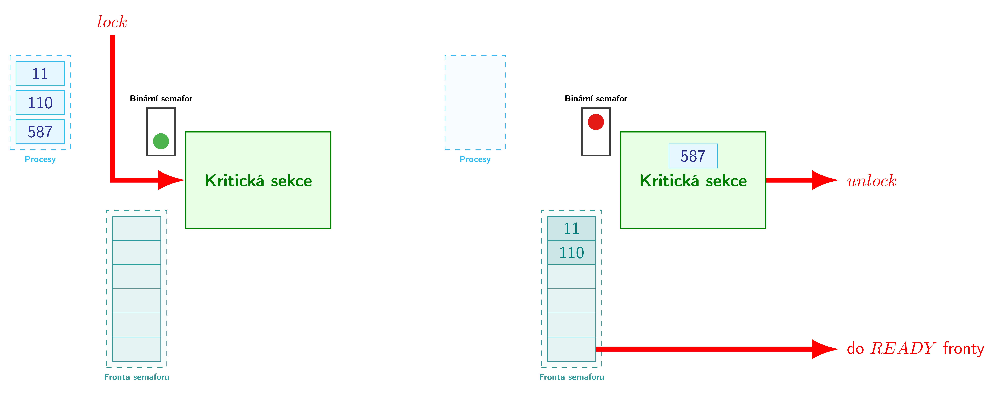

# HAW - schémata
Náčrtky a bloková schémata pro (mikro)procesory do předmětu HAW a nejen

## Blokové schéma mikroprocesoru
<picture>
  <source media="(prefers-color-scheme: dark)" srcset="block-diagram/mcpu_schema_flat.png">
  <source media="(prefers-color-scheme: light)" srcset="block-diagram/mcpu_schema.png">
  
</picture>

## Mutex
<picture>
  <source media="(prefers-color-scheme: dark)" srcset="mutex/dist/png/mutex_flatten.png">
  <source media="(prefers-color-scheme: light)" srcset="mutex/dist/png/mutex.png">
  
</picture>
