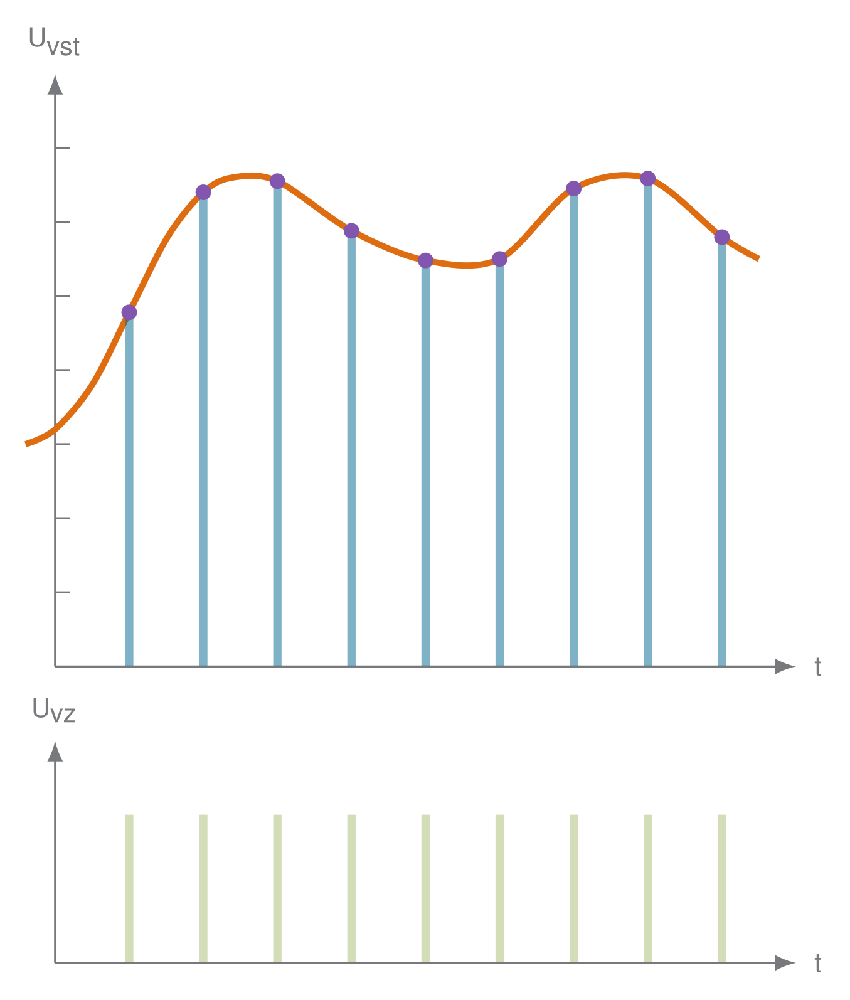

# ADC Visualization Gallery

This gallery showcases flat PNG variants of ADC-related diagrams generated from LaTeX sources.

| Preview | Description | Links |
|---------|-------------|-------|
|  | `01_analog` | [PDF](dist/pdf/01_analog.pdf) [SVG](dist/svg/01_analog.svg) [CFG](cfg/01_analog.cfg) [TeX](ad_conversion_universal.tex) |
|  | `02_sampling_impulses` | [PDF](dist/pdf/02_sampling_impulses.pdf) [SVG](dist/svg/02_sampling_impulses.svg) [CFG](cfg/02_sampling_impulses.cfg) [TeX](ad_conversion_universal.tex) |
|  | `03_sampling_impulses_mapped` | [PDF](dist/pdf/03_sampling_impulses_mapped.pdf) [SVG](dist/svg/03_sampling_impulses_mapped.svg) [CFG](cfg/03_sampling_impulses_mapped.cfg) [TeX](ad_conversion_universal.tex) |
|  | `04_sampling_samples` | [PDF](dist/pdf/04_sampling_samples.pdf) [SVG](dist/svg/04_sampling_samples.svg) [CFG](cfg/04_sampling_samples.cfg) [TeX](ad_conversion_universal.tex) |
|  | `05_sampling_samples_2` | [PDF](dist/pdf/05_sampling_samples_2.pdf) [SVG](dist/svg/05_sampling_samples_2.svg) [CFG](cfg/05_sampling_samples_2.cfg) [TeX](ad_conversion_universal.tex) |
|  | `06_sampling_samples_no_analog` | [PDF](dist/pdf/06_sampling_samples_no_analog.pdf) [SVG](dist/svg/06_sampling_samples_no_analog.svg) [CFG](cfg/06_sampling_samples_no_analog.cfg) [TeX](ad_conversion_universal.tex) |
|  | `07_sampling_sample_values` | [PDF](dist/pdf/07_sampling_sample_values.pdf) [SVG](dist/svg/07_sampling_sample_values.svg) [CFG](cfg/07_sampling_sample_values.cfg) [TeX](ad_conversion_universal.tex) |
|  | `08_quant_levels` | [PDF](dist/pdf/08_quant_levels.pdf) [SVG](dist/svg/08_quant_levels.svg) [CFG](cfg/08_quant_levels.cfg) [TeX](ad_conversion_universal.tex) |
|  | `09_quant_sublevels` | [PDF](dist/pdf/09_quant_sublevels.pdf) [SVG](dist/svg/09_quant_sublevels.svg) [CFG](cfg/09_quant_sublevels.cfg) [TeX](ad_conversion_universal.tex) |
|  | `10_quant_labels` | [PDF](dist/pdf/10_quant_labels.pdf) [SVG](dist/svg/10_quant_labels.svg) [CFG](cfg/10_quant_labels.cfg) [TeX](ad_conversion_universal.tex) |
|  | `11_quant_labels_only` | [PDF](dist/pdf/11_quant_labels_only.pdf) [SVG](dist/svg/11_quant_labels_only.svg) [CFG](cfg/11_quant_labels_only.cfg) [TeX](ad_conversion_universal.tex) |
|  | `12_quant_points_only` | [PDF](dist/pdf/12_quant_points_only.pdf) [SVG](dist/svg/12_quant_points_only.svg) [CFG](cfg/12_quant_points_only.cfg) [TeX](ad_conversion_universal.tex) |
|  | `13_quant_points_values` | [PDF](dist/pdf/13_quant_points_values.pdf) [SVG](dist/svg/13_quant_points_values.svg) [CFG](cfg/13_quant_points_values.cfg) [TeX](ad_conversion_universal.tex) |
|  | `14_quant_quantization` | [PDF](dist/pdf/14_quant_quantization.pdf) [SVG](dist/svg/14_quant_quantization.svg) [CFG](cfg/14_quant_quantization.cfg) [TeX](ad_conversion_universal.tex) |
|  | `15_quant_quantization_2` | [PDF](dist/pdf/15_quant_quantization_2.pdf) [SVG](dist/svg/15_quant_quantization_2.svg) [CFG](cfg/15_quant_quantization_2.cfg) [TeX](ad_conversion_universal.tex) |
|  | `16_quant_quantization_only` | [PDF](dist/pdf/16_quant_quantization_only.pdf) [SVG](dist/svg/16_quant_quantization_only.svg) [CFG](cfg/16_quant_quantization_only.cfg) [TeX](ad_conversion_universal.tex) |
|  | `17_quant_quantization_only_values` | [PDF](dist/pdf/17_quant_quantization_only_values.pdf) [SVG](dist/svg/17_quant_quantization_only_values.svg) [CFG](cfg/17_quant_quantization_only_values.cfg) [TeX](ad_conversion_universal.tex) |
|  | `18_coding` | [PDF](dist/pdf/18_coding.pdf) [SVG](dist/svg/18_coding.svg) [CFG](cfg/18_coding.cfg) [TeX](ad_conversion_universal.tex) |
|  | `19_coding_reconstruction` | [PDF](dist/pdf/19_coding_reconstruction.pdf) [SVG](dist/svg/19_coding_reconstruction.svg) [CFG](cfg/19_coding_reconstruction.cfg) [TeX](ad_conversion_universal.tex) |
|  | `20_coding_reconstruction_with_analog` | [PDF](dist/pdf/20_coding_reconstruction_with_analog.pdf) [SVG](dist/svg/20_coding_reconstruction_with_analog.svg) [CFG](cfg/20_coding_reconstruction_with_analog.cfg) [TeX](ad_conversion_universal.tex) |
|  | `21_coding_reconstruction_only` | [PDF](dist/pdf/21_coding_reconstruction_only.pdf) [SVG](dist/svg/21_coding_reconstruction_only.svg) [CFG](cfg/21_coding_reconstruction_only.cfg) [TeX](ad_conversion_universal.tex) |
|  | `22_coding_reconstruction_pure` | [PDF](dist/pdf/22_coding_reconstruction_pure.pdf) [SVG](dist/svg/22_coding_reconstruction_pure.svg) [CFG](cfg/22_coding_reconstruction_pure.cfg) [TeX](ad_conversion_universal.tex) |
|  | `23_coding_noise` | [PDF](dist/pdf/23_coding_noise.pdf) [SVG](dist/svg/23_coding_noise.svg) [CFG](cfg/23_coding_noise.cfg) [TeX](ad_conversion_universal.tex) |