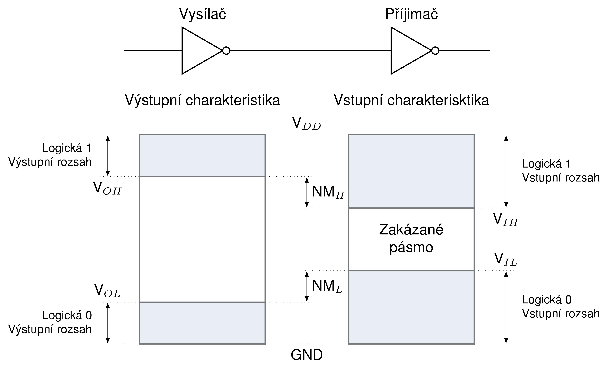

# Logické stavy a úrovně

## Digitální svět v kostce: 0 a 1 - klíč k moderní elektronice

Představte si jednoduchý obvod: spínač, žárovka a baterie. Zapnutím spínače rozsvítíme žárovku, vypnutím zhasne. 
V digitálním světě to funguje podobně, ale s jedním zásadním rozdílem: Místo nekonečného spektra stavů "zapnuto" 
a "vypnuto" pracujeme jen se dvěma jasně definovanými: **0** a **1**.

Proč to děláme? Protože s 0 a 1 se dá dělat úžasná kouzla! Můžeme je skládat, kombinovat a porovnávat, čímž otevíráme
dveře k neuvěřitelným možnostem. Tranzistory, ty miniaturní stavební bloky moderní elektroniky, v podstatě jen přepínají
mezi 0 a 1, a tím řídí složité funkce našich počítačů, mobilů a dalších chytrých zařízení.

Abychom se v tomto světě 0 a 1 lépe orientovali, domluvili jsme se na symbolech. **0** obvykle značí nízký napěťový signál,
**1** naopak vysoký. Někdy používáme i anglické výrazy "false" a "true" nebo české "nepravda" a "pravda". Důležité je, 
abychom si vždycky uvědomili, co dané symboly v daném kontextu znamenají.

Rozlišovat mezi 0 a 1 ale není vždycky snadné. V reálném světě se můžou objevit drobné výkyvy napětí, které by mohly vést k chybám.
Proto používáme tzv. **logický zdvih**, což je jakési "ochranné pásmo" mezi 0 a 1. Čím širší je toto pásmo, tím lépe rozlišujeme
jednotlivé stavy a tím je systém odolnější proti rušení.

### Klíčové pojmy

* Digitální technika
* Binární systém
* Logické hodnoty (0, 1)
* Logický zdvih
* Tranzistor
* Napětí

### Příklady

* Spínač a žárovka: Spínač v binárním systému představuje proměnnou "SPÍNAČ", která může nabývat dvou stavů: ZAPNUTO (1) a VYPNUTO (0).
* Tranzistor: Tranzistor v binárním systému funguje jako přepínač mezi 0 a 1, čímž řídí tok elektrického proudu v obvodu.
* Počítač: Počítač ukládá a zpracovává informace pomocí binárního kódu, tj. pomocí sekvencí 0 a 1.

### Důležité

* V binárním systému existují pouze dva stavy: 0 a 1.
* Logické hodnoty 0 a 1 se obvykle reprezentují nízkým a vysokým napěťovým signálem.
* Logický zdvih je pásmo napětí mezi 0 a 1, které zajišťuje spolehlivé rozlišování logických hodnot.
* Digitální technika je základem moderní elektroniky a umožňuje nám tvořit a měnit svět okolo sebe.

