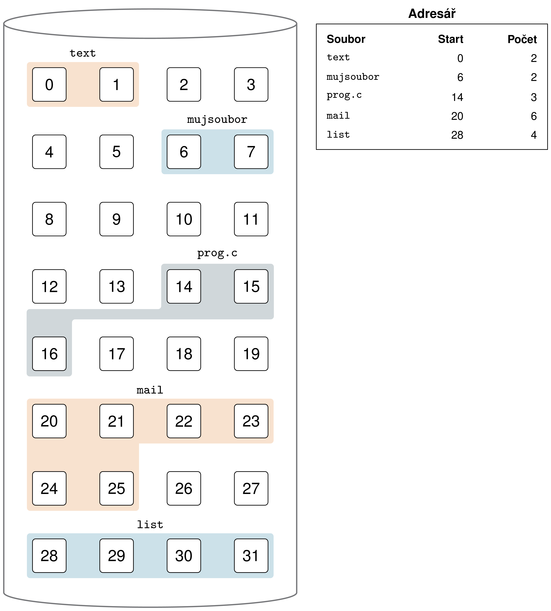
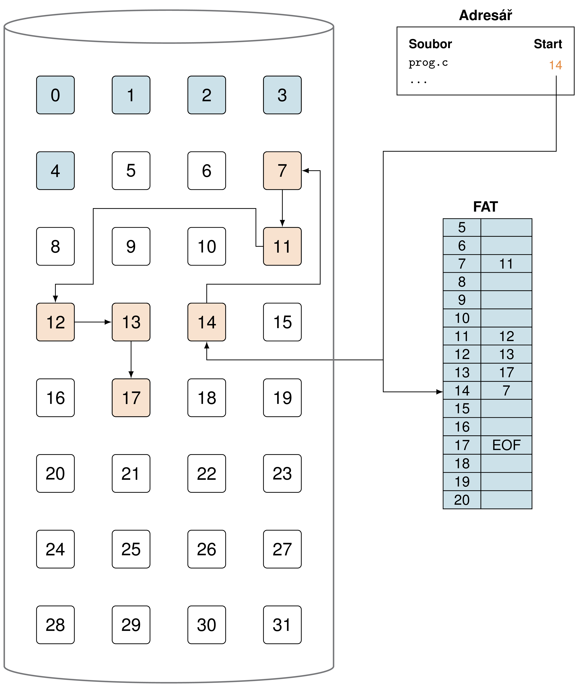
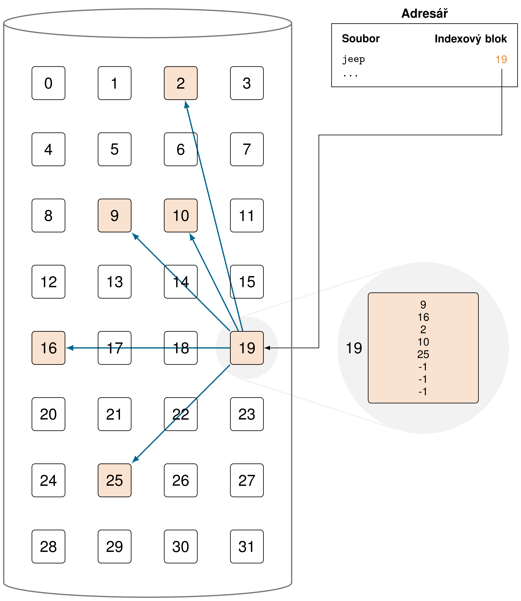
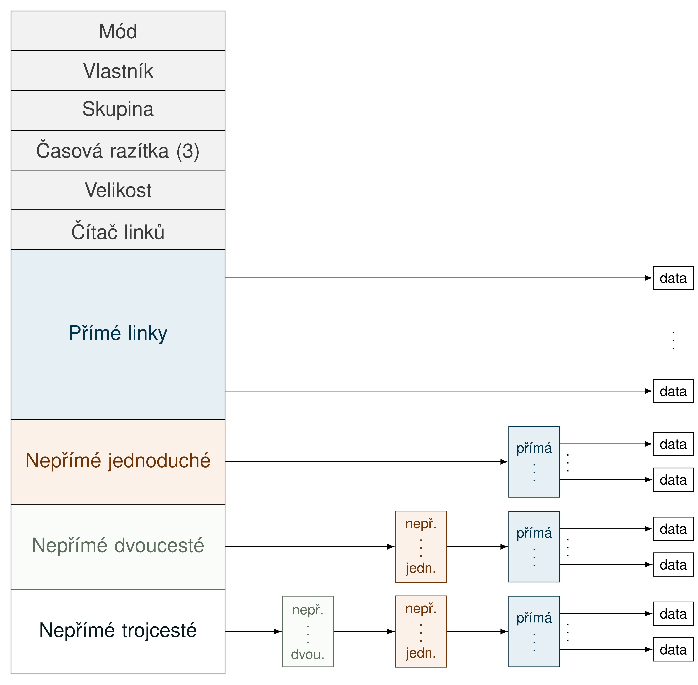

# Souborový systém - alokace

## Přímá
<picture>
  <!--source media="(prefers-color-scheme: dark)" srcset="block-diagram/mcpu_schema_flat.png">
  <source media="(prefers-color-scheme: light)" srcset="block-diagram/mcpu_schema.png"-->
  
</picture>

## Nepřímá

### Spojový seznam (FAT)
<picture>
  <!--source media="(prefers-color-scheme: dark)" srcset="block-diagram/mcpu_schema_flat.png">
  <source media="(prefers-color-scheme: light)" srcset="block-diagram/mcpu_schema.png"-->
  
</picture>

### Indexová alokace
<picture>
  <!--source media="(prefers-color-scheme: dark)" srcset="block-diagram/mcpu_schema_flat.png">
  <source media="(prefers-color-scheme: light)" srcset="block-diagram/mcpu_schema.png"-->
  
</picture>

#### I-node
<picture>
  <!--source media="(prefers-color-scheme: dark)" srcset="block-diagram/mcpu_schema_flat.png">
  <source media="(prefers-color-scheme: light)" srcset="block-diagram/mcpu_schema.png"-->
  
</picture>
